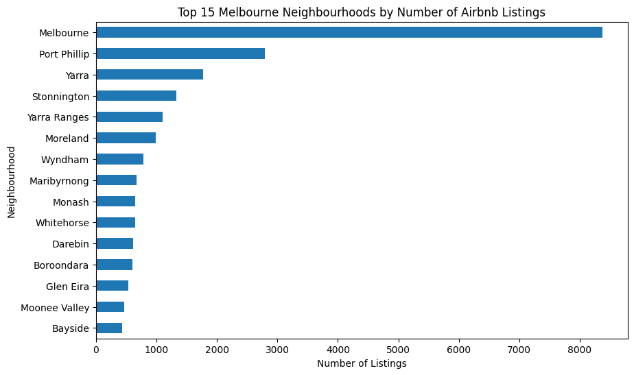
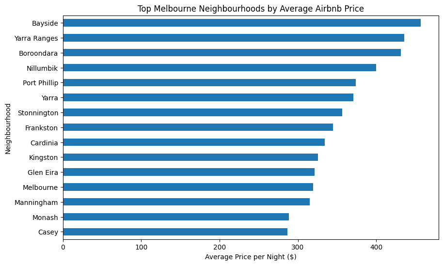
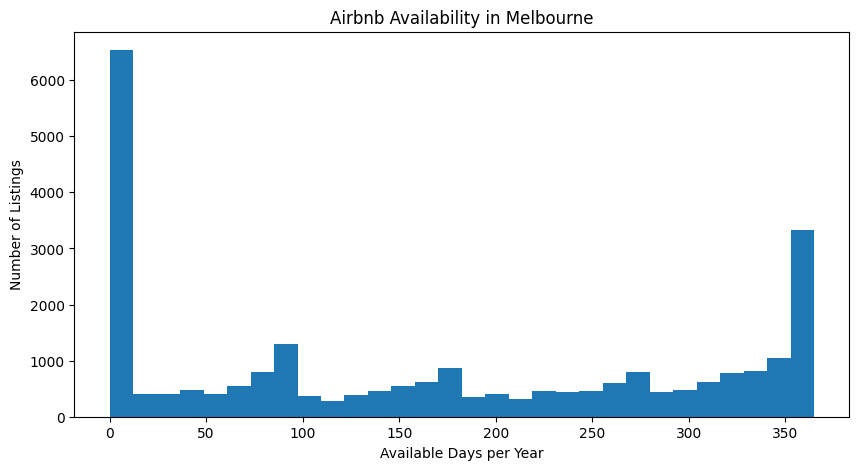
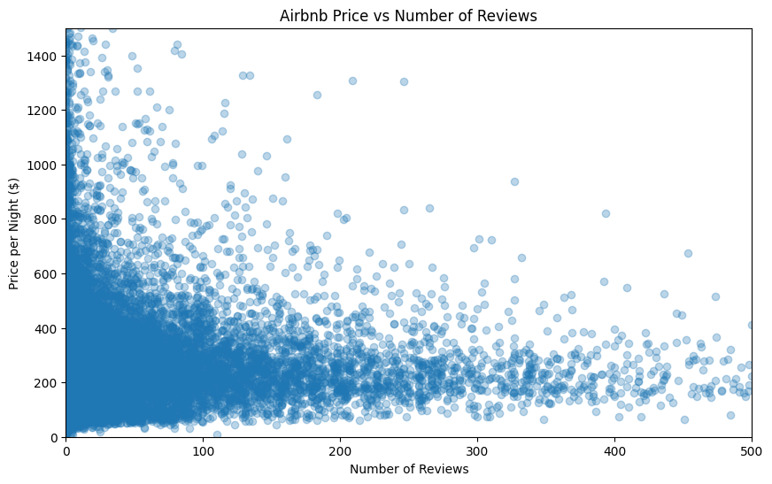
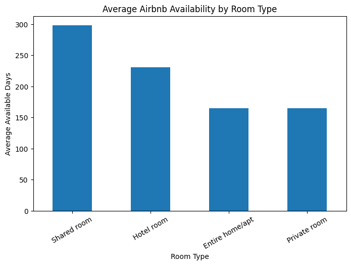
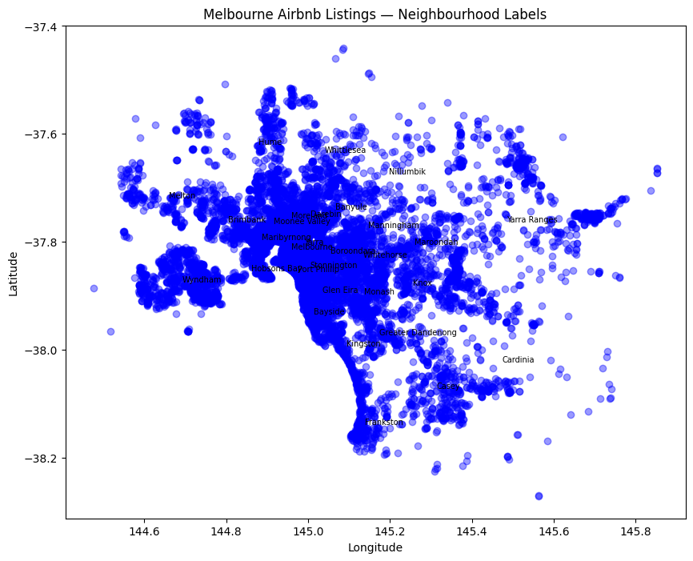

# Melbourne Airbnb Data Analysis

## 📌 Project Overview

This project analyses Airbnb listings in Melbourne, Australia, using Python and Pandas.

The main objective is to explore the characteristics of Airbnb listings, understand pricing patterns, compare different room types, and identify factors that may influence Airbnb prices and availability.

The project demonstrates practical skills in data cleaning, exploratory data analysis (EDA), statistical analysis, data visualisation, and extracting meaningful insights from real-world data.

---

## 🎯 Project Objectives

- Analyse Airbnb listings in Melbourne.
- Clean and prepare the dataset for analysis.
- Investigate Airbnb listing prices.
- Compare prices across different room types.
- Analyse neighbourhood and location patterns.
- Examine minimum-night requirements.
- Investigate availability of Airbnb listings.
- Analyse reviews and listing popularity.
- Identify factors associated with Airbnb pricing.
- Create meaningful visualisations from the dataset.
- Generate data-driven insights to support decision-making.

--

## 📊 Dataset

The dataset contains information about Airbnb listings in Melbourne.

Important variables used in the analysis include:

| Variable | Description |
|---|---|
| `id` | Unique listing identifier |
| `name` | Name of the Airbnb listing |
| `host_id` | Unique host identifier |
| `host_name` | Name of the host |
| `neighbourhood` | Listing neighbourhood |
| `latitude` | Geographic latitude |
| `longitude` | Geographic longitude |
| `room_type` | Type of accommodation |
| `price` | Price of the listing |
| `minimum_nights` | Minimum number of nights required |
| `number_of_reviews` | Number of reviews |
| `last_review` | Date of the latest review |
| `reviews_per_month` | Average reviews per month |
| `calculated_host_listings_count` | Number of listings managed by the host |
| `availability_365` | Number of available days per year |

---

## 🛠️ Technologies Used

### Programming Language
- Python

### Libraries
- Pandas  
- NumPy  
- Matplotlib  
- Seaborn  

### Development Environment
- Google Colab 
- GitHub  

---

## 🔄 Data Analysis Workflow

Raw Airbnb Dataset
      ↓
Data Loading
      ↓
Data Exploration
      ↓
Data Cleaning
      ↓
Handling Missing Values
      ↓
Data Transformation
      ↓
Exploratory Data Analysis
      ↓
Statistical Analysis
      ↓
Data Visualisation

---

# 📈 Key Visualisations

## **1. Top 15 Neighbourhoods by Number of Listings**
Shows which neighbourhoods have the most Airbnb listings.

---

## **2. Top Neighbourhoods by Average Price**
Shows which neighbourhoods are most expensive.

## **3. Airbnb Availability in Melbourne**
Shows how many days per year listings are available.

---

## **4. Price vs Number of Reviews**
Shows the relationship between listing price and review count.

---

## **5. Average Availability by Room Type**
Compares availability across room types.

---

## **6. Geographic Distribution of Listings**
Shows where listings are located across Melbourne.

---

## 📌 Conclusion

This analysis provides valuable insights into Melbourne’s Airbnb market, including pricing trends, neighbourhood patterns, room-type availability, and listing popularity. These findings can support hosts, travellers, and policymakers in understanding market behaviour and making informed decisions.

---

## 🚀 Future Improvements

Although this project provides strong insights into Melbourne’s Airbnb market, several enhancements can make the analysis more comprehensive and powerful:

### 🔧 1. Add Machine Learning Price Prediction
Build a predictive model (e.g., Linear Regression, Random Forest, XGBoost) to estimate Airbnb prices based on:
- Neighbourhood
- Room type
- Availability
- Number of reviews
- Host listing count

### 🗺️ 2. Create Interactive Maps
Use tools like Folium or Plotly to create interactive geographic visualisations:
- Clickable markers for listings
- Heatmaps of price distribution
- Neighbourhood-level clustering

### 📈 3. Time-Series Analysis
Analyse how Airbnb prices and availability change over time:
- Seasonal trends
- Impact of holidays or events
- Year-over-year changes

### 🧹 4. Advanced Data Cleaning
Improve data quality by:
- Handling outliers more effectively
- Normalising price values
- Removing duplicate listings

### ⭐ 5. Host Behaviour Analysis
Explore host patterns such as:
- Multi‑listing hosts
- Superhost trends
- Host response rates and review patterns

### 📊 6. Dashboard Creation
Build a dashboard using:
- Power BI
- Tableau
- Streamlit

This would allow users to explore Airbnb data interactively.

### 📦 7. Expand Dataset
Include additional datasets such as:
- Property features (bedrooms, bathrooms)
- Distance to city landmarks
- Public transport accessibility
- Crime rates or safety scores

### 📝 8. Automate Data Updates
Create a pipeline to automatically refresh the dataset and regenerate visualisations.

---

## 📁 Project Structure

melbourne-airbnb-data-analysis/
│
├── data/
│   └── listings.csv

├── Melbourne_Airbnb_Data_Analysis_.ipynb
├── requirements.txt
├── LICENSE
└── README.md

## 🔗 GitHub Repository
<https://github.com/adikari1330/melbourne-airbnb-data-analysis>

